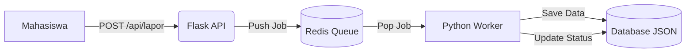

# 📢 Sistem Pengaduan Fasilitas Kampus (Distributed System)

Sistem pelaporan kerusakan fasilitas kampus yang dibangun menggunakan pendekatan **Sistem Terdistribusi Sederhana**. Proyek ini memisahkan layanan penerima pesan (Producer/API) dan pemroses pesan (Consumer/Worker) menggunakan **Redis Message Broker** untuk menjamin data tidak hilang saat server sibuk (*High Availability*).

> **Project Based Learning (PBL) - Mata Kuliah Sistem Terdistribusi**

---

## 🌟 Fitur Utama

✅ **Arsitektur Asinkron:** Pengiriman laporan tidak membuat antarmuka pengguna macet (Non-blocking).  
✅ **Message Queue:** Menggunakan Redis `LPUSH` dan `BRPOP` untuk antrean tugas yang persisten.  
✅ **Real-time Monitoring:** Status laporan (Pending -> Diproses -> Selesai) terpantau secara langsung.  
✅ **Bukti Foto:** Mahasiswa dapat mengunggah foto kerusakan fasilitas.  
✅ **Prioritas Laporan:** Kategorisasi urgensi (Darurat 🔴, Sedang 🟡, Biasa 🟢).  
✅ **Push Notification:** Notifikasi browser muncul otomatis saat laporan selesai diperbaiki.  

---

## 🏗️ Arsitektur Sistem

Sistem ini terdiri dari 3 komponen utama yang berjalan secara independen:

1.  **Producer (Flask API):** Menerima input HTTP dari mahasiswa dan mengirimkan *payload* ke antrean Redis.
2.  **Message Broker (Redis):** Menampung antrean laporan (buffer) di memori.
3.  **Consumer (Python Worker):** Mengambil tugas dari Redis, memprosesnya (simulasi perbaikan), dan menyimpan ke database JSON.

🚀 Cara Menjalankan (Installation)
Prasyarat
Python 3.x terinstall.

Redis Server terinstall dan berjalan (Port 6379).

Langkah 1: Clone & Install

git clone [https://github.com/Emzyjeppp/Sistem-Pengaduan-Kampus.git](https://github.com/Emzyjeppp/Sistem-Pengaduan-Kampus.git)
cd Sistem-Pengaduan-Kampus
pip install flask redis

Langkah 2: Jalankan Komponen
Buka 2 Terminal berbeda untuk menjalankan sistem ini:

Terminal 1 (Jalankan API Server):
python api_producer.py
# Server akan berjalan di http://localhost:5000

Terminal 2 (Jalankan Worker):
python worker.py
# Worker akan standby menunggu pesan masuk...

📖 Panduan Penggunaan
1. Mahasiswa (Pelapor)
Buka browser ke http://localhost:5000.
Isi Nama, Lokasi, dan Deskripsi.
Pilih tingkat Prioritas (Darurat/Sedang/Biasa).
(Opsional) Upload Foto Bukti.
Klik Kirim Laporan. Status akan muncul di bawah form.

2. Teknisi (Admin)
Buka browser ke http://localhost:5000/admin.
Lihat daftar laporan masuk. Gunakan Filter Prioritas untuk melihat yang 'Darurat' saja.
Klik Lihat Foto untuk memverifikasi kerusakan.
Klik tombol Selesai jika perbaikan sudah tuntas.
Sistem akan otomatis mengirim notifikasi ke browser mahasiswa.

### 📖 Dokumentasi Penggunaan
Unduh panduan lengkap cara penggunaan sistem di sini: 👉 [Panduan Penggunaan (Google Drive)](https://drive.google.com/file/d/1NouUQ7-AAW_Y50azdUZX5WQAtbKb8woq/view?usp=drive_link))
