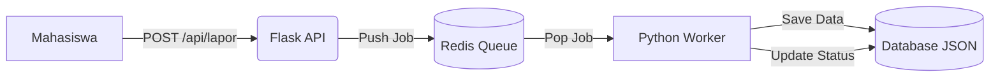

# 📢 Sistem Pengaduan Fasilitas Kampus (Distributed System)


Sistem pelaporan kerusakan fasilitas kampus yang dibangun menggunakan pendekatan **Sistem Terdistribusi Sederhana**. Proyek ini memisahkan layanan penerima pesan (Producer/API) dan pemroses pesan (Consumer/Worker) menggunakan **Redis Message Broker** untuk menjamin data tidak hilang saat server sibuk (*High Availability*).

> **Project Based Learning (PBL) - Mata Kuliah Sistem Terdistribusi**

---

## 🌟 Fitur Utama

✅ **Arsitektur Asinkron:** Pengiriman laporan tidak membuat antarmuka pengguna macet (Non-blocking).  
✅ **Message Queue:** Menggunakan Redis `LPUSH` dan `BRPOP` untuk antrean tugas yang persisten.  
✅ **Real-time Monitoring:** Status laporan (Pending -> Diproses -> Selesai) terpantau secara langsung.  
✅ **Bukti Foto:** Mahasiswa dapat mengunggah foto kerusakan fasilitas.  
✅ **Prioritas Laporan:** Kategorisasi urgensi (Darurat 🔴, Sedang 🟡, Biasa 🟢).  
✅ **Push Notification:** Notifikasi browser muncul otomatis saat laporan selesai diperbaiki.  

---

## 🏗️ Arsitektur Sistem

Sistem ini terdiri dari 3 komponen utama yang berjalan secara independen:

1.  **Producer (Flask API):** Menerima input HTTP dari mahasiswa dan mengirimkan *payload* ke antrean Redis.
2.  **Message Broker (Redis):** Menampung antrean laporan (buffer) di memori.
3.  **Consumer (Python Worker):** Mengambil tugas dari Redis, memprosesnya (simulasi perbaikan), dan menyimpan ke database JSON.


```
📂 Struktur Folder
Sistem-Pengaduan-Kampus/
├── static/
│   └── uploads/        # Tempat penyimpanan foto bukti
├── templates/
│   ├── index.html      # Halaman Lapor (Mahasiswa)
│   └── admin.html      # Halaman Dashboard (Teknisi)
├── api_producer.py     # Main Server (Flask)
├── worker.py           # Background Process
├── database_laporan.json
├── requirements.txt
└── README.md

